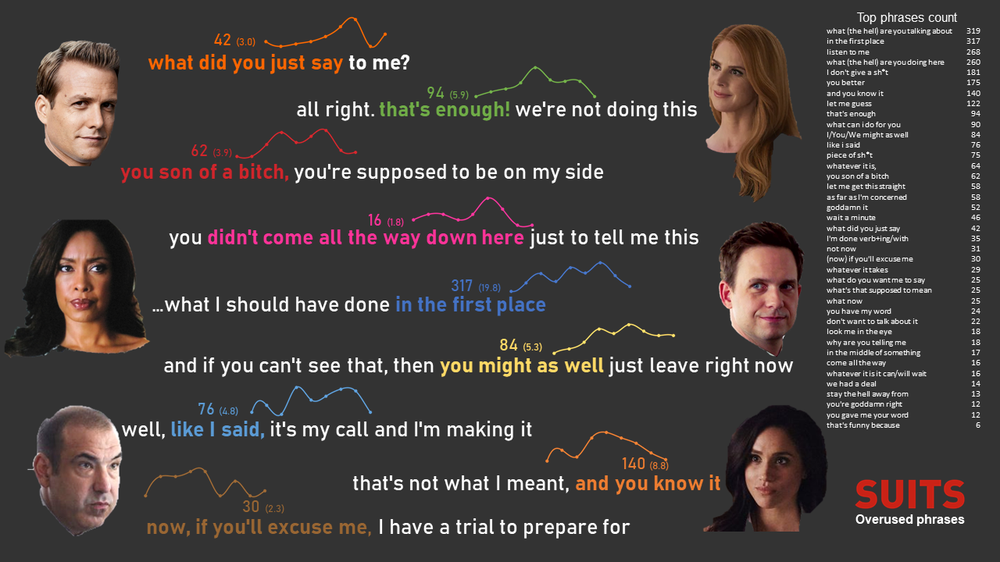

# Suits Overused Phrases

## Motivation
Whoever has watched enough of the TV show Suits knows that there are specific phrases repeated over and over in many episodes. 
Not only that but these phrases are used by many characters, as if they all have the same way of talking.

Feeling the urge to quantify this observation, this notebook downloads, parses and analyses all the subtitles 
from all 134 episodes (9 seasons) of Suits. It uses n-grams to assit finding common phrases and regular expressions to match them and similar ones in the subtitles corpus.

## Tools
- [requests](https://requests.readthedocs.io/en/master/) and [BeautifulSoup](https://www.crummy.com/software/BeautifulSoup/bs4/doc/) to fetch and 
parse episode transcripts from online source
- Python's [re](https://docs.python.org/3/library/re.html) for Regular Expressions to match similar phrases
- [nltk](https://www.nltk.org/) for most common n-grams detection
- [matplotlib](https://matplotlib.org/) and PowerPoint for final visualization
